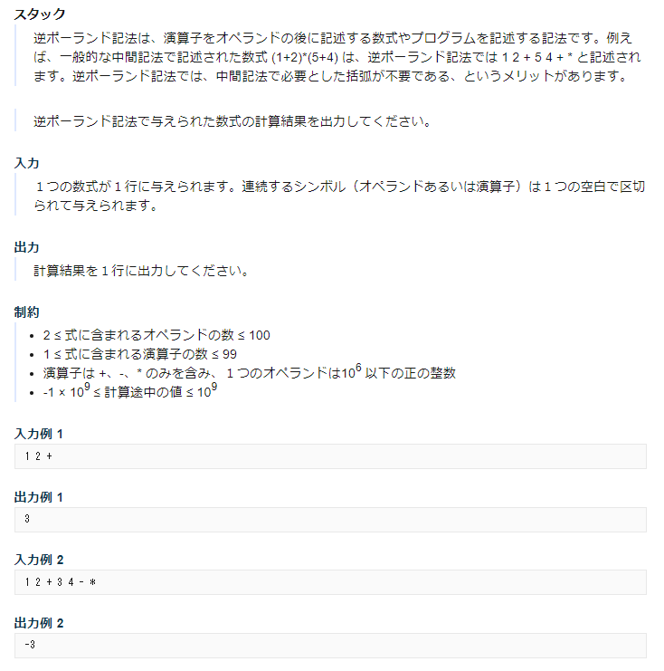

# データ構造

## データ構造とは

データ構造は以下の3つの概念で成り立っている。

- (データの)集合  
  配列や構造体などの基本データ構造でデータの集合を保持
- 規則  
  集合を正しく操作/管理/保持するための一定のルール
- 操作  
  「要素の挿入」や「要素の取り出し」などデータの集合に対する操作。  
  「要素数を調べる」、「集合が空かどうか調べる」という問い合わせも含まれる。

### 基本的なデータ構造

- スタック  
  一時的なデータ退避に有効なデータ構造。  
  最後に入ったデータが最初に取り出される(LIFO: Last In First Out)。
- キュー  
  データの到着順に処理際に有効なデータ構造。
  最初に入ったデータが最初に取り出される(FIFO: First In First Out)。
- リスト  
  順序を保ちつつ特定位置へのデータ追加、削除が可能なデータ構造。

## スタック

### 問題

[https://judge.u-aizu.ac.jp/onlinejudge/description.jsp?id=ALDS1_3_A&lang=ja](https://judge.u-aizu.ac.jp/onlinejudge/description.jsp?id=ALDS1_3_A&lang=ja)


### 回答

スタックをClassで実装してみると以下のような感じ。  
本来はスタックが空かどうかの確認(isEmpty())や、スタックが満杯かどうかの確認(isFull())も実装し、pop()やpush()時にエラー処理を行うべき。

配列Sのidx0は使用しない。  
topはスタック内の最終要素のidxであり、スタック内の要素数でもある。  
topが0の場合はスタックが空であることを示す。

```cpp
#include <bits/stdc++.h>
using namespace std;

constexpr int MAX_NUM_ELEM = 128;

class opeStack {
private:
    int S[MAX_NUM_ELEM];
    int top;

public:
    opeStack() : top(0) { }
    int push(int x) {
        // topをインクリメントしてxを設定
        S[++top] = x;
        return top;
    }
    int pop() {
        // topが指している値を返却し、デクリメント
        return S[top--];
    }
};

int main() {
    opeStack S;
    int a, b;
    char s[10];
    while (scanf("%s", s) != EOF) {
        if (s[0] == '+') {
            b = S.pop();
            a = S.pop();
            S.push(a + b);
        } else if (s[0] == '-') {
            b = S.pop();
            a = S.pop();
            S.push(a - b);
        } else if (s[0] == '*') {
            b = S.pop();
            a = S.pop();
            S.push(a * b);
        } else {
            S.push(atoi(s));
        }
    }

    cout << S.pop() << endl;
    return 0;
}
```
